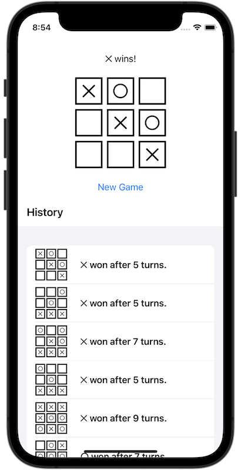

# Concept Review

This project contains example apps that take their primary input from a variety of sources.

## Input by User Action

### Multiplication Maestro

*Multiplication Maestro* generates data entirely from user actions when [answers to questions are provided in a text field](x-source-tag://mm_user_action).

Sequence and selection statements are used to detect whether the input provided by a user is the [correct response to a question](x-source-tag://mm_answer_correct).

Abstraction is used in the views that together form the [primary quizzing interface](x-source-tag://mm_primary_interface) of the app:

* [`QuestionPresentationView`](x-source-tag://mm_question_presentation)
* [`AnswerAndResultView`](x-source-tag://mm_answer_and_result)
* [`CheckAnswerButtonView`](x-source-tag://mm_check_answer_button)
* [`NewQuestionButtonView`](x-source-tag://mm_new_question)

This helps to manage complexity as without these "helper" views the code for the entire quizzing interface would be quite long. By "abstracting out" the logic for individual parts of the larger interface into their own smaller views, we can test discrete parts of the app separately from the larger whole. This makes it easier to test new code and track down bugs.   

As questions are answered, results are added to the list, with the most recent question at the top. The contents of the list are then available for review by the user. The *results* list manages complexity by allowing us to display an open-ended number of prior questions that the user has completed. We don't know how many questions a user will complete. It's not possible to predict how many individual variables would be needed. Instead, as each question is completed, we can simply create a new instance of the [`Result` structure](x-source-tag://mm_result_structure) and then [add that to the list](x-source-tag://mm_adding_to_list).

### Noughts and Crosses

*Noughts and Crosses*, also known as "x's and o's", generates data entirely from [user actions that trigger events](x-source-tag://user_action).

Sequence and selection statements are used to detect a [winning condition](x-source-tag://winning_condition) – three of the same symbol in a row, column, or diagonal. If nine turns occur and neither player's moves triggers a winning condition, a draw is obtained.

Abstraction is used through the [`TileView` structure](x-source-tag://tile_view) – this helps to manage complexity as the same logic would otherwise be completely repeated nine times within `GameBoardView`. Instead, the logic for a tile is *defined* once and simply *called* nine times from [`GameBoardView`](x-source-tag://game_board). As a result, overall project code length is significantly reduced.

When a game is completed, the [result is added to a list](x-source-tag://adding_to_list) that tracks the history of games played. This list is then displayed to the user in the History section of the user interface. The list helps to manage complexity because we do not know how many games a user will play in advance; it is not possible to predict how many individual variables we'd need to create. So instead we create a new instance of the [`GameResult` structure](x-source-tag://nac_game_result) every time a game is completed, and add that to the list, whose maximum capacity for holding past games is open-ended, limited only by available memory on the device.

* Callout(Bug Hunt):
  Develop your logical error detective skills. 🔎 
  
  There are at least three problems with the logic of this app.
  
  Play some games, tap around, and try to do things that a user should not do. Break the game!
  
  Once you find the problems, fix them.
  
  Then [on Spaces](https://ca.spacesedu.com/), identify the problems you found, and share your solutions, in your private portfolio space.
 
−

* Callout(Animation Action):
  Small animations add a lot of flair to an app. ✨ 
  
  When a tile is tapped and filled in with a player's symbol, make the tile rotate twice, quickly.
